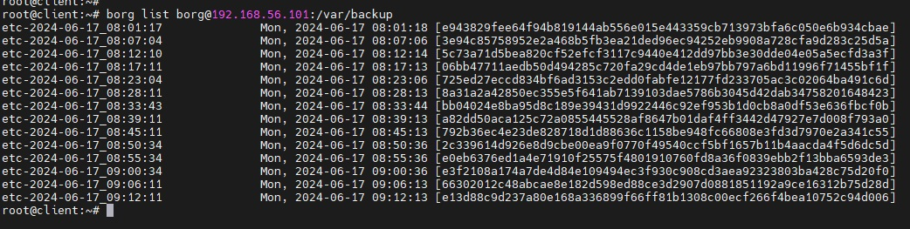
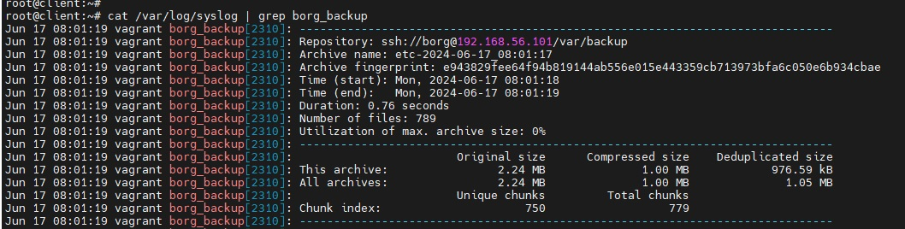

# Otus Homework 17. Резервное копирование
### Цель домашнего задания
Научиться настраивать резервное копирование с помощью утилиты Borg
### Описание домашнего задания
1. Настроить стенд Vagrant с двумя виртуальными машинами: backup_server и client.
2. Настроить удаленный бэкап каталога /etc c сервера client при помощи borgbackup. Резервные копии должны соответствовать следующим критериям:
    - директория для резервных копий /var/backup. Это должна быть отдельная точка монтирования. В данном случае для демонстрации размер не принципиален, достаточно будет и 2GB
    - репозиторий для резервных копий должен быть зашифрован ключом или паролем - на усмотрение студента
    - имя бэкапа должно содержать информацию о времени снятия бекапа
    - глубина бекапа должна быть год, хранить можно по последней копии на конец месяца, кроме последних трех. Последние три месяца должны содержать копии на каждый день
    - резервная копия снимается каждые 5 минут
    - написан скрипт для снятия резервных копий. Скрипт запускается из соответствующей Cron джобы, либо systemd timer-а - на усмотрение студента
    - настроено логирование процесса бекапа
## Выполнение
Задание будет выполняться с помощью **Vagrant** и **Ansible**
#### Настроить стенд Vagrant с двумя виртуальными машинами: backup_server и client.
В Vagrant разворачивает тестовый стенд:
* **backup**
  - backup сервер
  - **IP-адрес:** 192.168.56.101
* **client**
  - клиент, на котором настраиваем резервное кпопирование  
  - **IP-адрес:** 192.168.56.102
#### Настроить удаленный бэкап каталога /etc c сервера client при помощи borgbacku
На ВМ с установленным Ansible запускаем playbook:
```bash
ansible-playbook borg.yml
```
Playbook устаналивает *borgbackup* на обе виртуальные машины. На ВМ **backup** в каталог /var/backup монтируется отдельный диск /dav/sdb.
Создаем пользователя *borg*, с помощью которого будет осуществляться подключение по SSH с клиента для выполнения резервного копирования.  

На **client** инициализируем репозиторий:
```bash
borg init --encryption=repokey borg@192.168.56.101:/var/backup/
```
Запуск резервного копирования осуществим с помощью systemd юнита, активируемого по systemd таймеру каждые 5 минут:
##### /etc/systemd/system/borg.service
```bash
[Unit]
Description=Borg Backup

[Service]
Type=oneshot
Environment="BORG_PASSPHRASE=Qwerty123"
Environment=REPO=borg@192.168.56.101:/var/backup/
Environment=BACKUP_TARGET=/etc
ExecStart=/bin/borg create   \
          --stats                          \
          ${REPO}::etc-{now:%%Y-%%m-%%d_%%H:%%M:%%S} ${BACKUP_TARGET}
ExecStart=/bin/borg check ${REPO}
ExecStart=/bin/borg prune  \
    --keep-within 1d       \
    --keep-daily  90       \
    --keep-monthly 12      \
    --keep-yearly  1       \
    ${REPO}
StandardOutput=syslog
StandardError=syslog
SyslogIdentifier=borg_backup
```
Данный юнит выполняет следующие задачи:
- запускает процесс резервного копирования каталога /etc/ на ВМ backup в каталог /var/backup. Имя резревной копии содержит дату запуска
```bash
/bin/borg create --stats ${REPO}::etc-{now:%%Y-%%m-%%d_%%H:%%M:%%S} ${BACKUP_TARGET}
```
- проверяет целостность репозитория и архивов
```bash
/bin/borg check ${REPO}
```
- выполняет ротацию резервных копий в оответсвии с заданием:
    - хранятся ежедневные резервные копии за последние 3 месяца
    - ежемесячные копии за последний год
    - одна ежегодная копия
    - дополнительно, для демонстрации запуска каждые 5 минут, хранятся все копии за день.
```bash
/bin/borg prune --keep-within 1d --keep-daily  90 --keep-monthly 12 --keep-yearly  1 ${REPO}
```
С помощью директив *StandardOutput*, *StandardError*, *SyslogIdentifier* настроено логирование с **syslog** с тэгом *borg_backup*:
```bash
StandardOutput=syslog
StandardError=syslog
SyslogIdentifier=borg_backup
```

Проверим, что задание выполянется успешно:  
  


Также убедимся, что запуск резервного копирования успешно логируется в syslog:  


